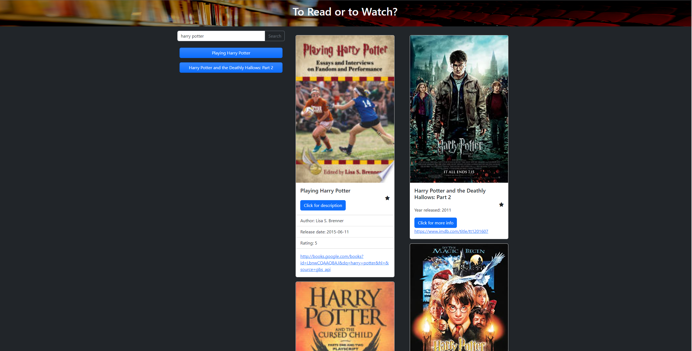

# To Read or to Watch

[Link to my project](https://djbartolini.github.io/movies-and-books/)

## Table of Contents
- [Description](#description-of-project)
- [Visuals](#visuals)
- [Support](#support)

## Description of project

This app allows movie and book enthusiasts to use one resource for gathering information about any book or movie related to the search. It is compiled with two lists where the user can explore movie and book options. If the user finds a movie or book they would like to save then the favorites feature can be utilized by clicking the favorites star and adding a button to repeat the search.

## Visuals

Preview of To Read or to Watch

## Support

If you encounter a problem with this application please reach out to Breakout Room 3 at dan.barto@gmail.com.